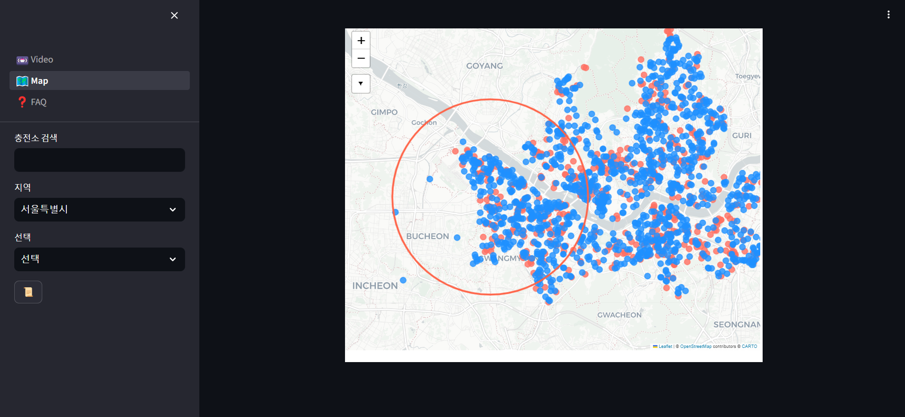
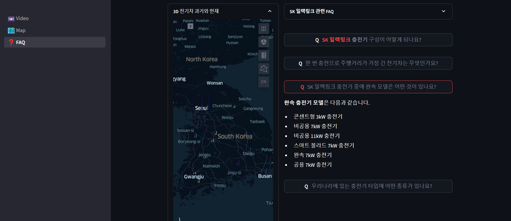
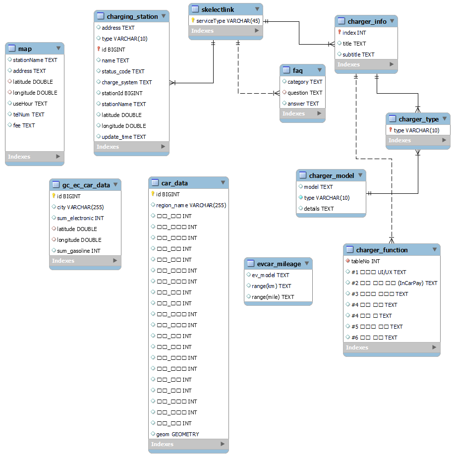

# SKN01-1st-4Team
### Contributors
**팀장** : 김지민  
**팀원** : 이용휘 이경민 이근 박윤서  
**역할** : ① 데이터 수집 ② DB 설계 ③ Streamlit 제작

 

### 주제
**전기차 및 충전소 현황과 SK 일렉링크 FAQ 조회 시스템 개발**

  
   

 

### 주제 선정 이유
- 급변하는 환경 변화에 전 세계가 환경문제에 신경을 쓰고 있으며, 모빌리티 업계에서도 이를 주목하고 있음
- SK네트웍스의 사업 중 하나인 SK 일렉링크는 전기차 충전기 구축 및 충전 서비스를 제공하고 있으며, 프로젝트 주제의 의미를 잘 담은 기업이라 판단하여 해당 기업의 FAQ 조회시스템을 개발 시나리오로 설정
- 수업시간에 이용한 데이터 수집 방법을(웹 크롤링, OpenAPI, 파일데이터)

 

### 사용 기술스택
| 데이터 수집 | DB설계 | 페이지 제작 |
|-------------|--------|-------------|
|     |   |    |

 

### 데이터
**수집**
- OpenAPI
  - 한국환경공단, 전기자동차 충전소 정보
  - 한국전력공사, 전기차 충전소 운영정보
- 웹 스크래핑
  - SK 일렉링크 홈페이지
- 파일데이터
  - 국토교통 통계누리, 자동차등록현황보고

 

**ERD**
- 테이블 개수 : 11개

</img>

 

